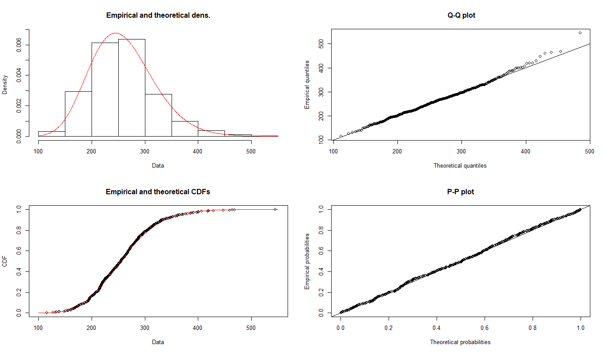

# About
Author: Sean Coffey 

***

## 1. What is this?

I briefly and somewhat chaotically outlined an approach to developing a ranking system for ozfortress in this public [google doc] (https://docs.google.com/document/d/1oYQlJoJSyu33cW_bFwgRcl-x1f1UyDfEnDLC5IXpPTg/edit?usp=sharing).

The information in this doc is still generally correct, and this website has been developed with the following functions:

1. **Current Player Rankings** - A way to compare and rank currently active players.
2. **Historical Season Rankings** - A way to compare players over time, based on season performance.
3. **Data Explorer** - A way for the inquisitive gamer to manually comb through the data themselves.

The only data included in this system are ozfortress premier officials.  While it would be nice to include other competitions (i.e. summer cups), and other divisions, at this stage this is unfortunately not practical.

***

## 2. What are these scores and how do I interpret them?
When looking at the following: Impact, Survivability, Efficiency, Objective, Season Score or Game Score, a percentage value is assigned.

For the sake of simplicity (for those who couldn't be bothered learning statistics in high school):

* 50% - this is exactly average and a player with this score in anything is performing about as well as they could be expected
* > 60% - this is now a good score for whatever the variable is
* > 70% - this is ELITE
* < 40% - this is getting into the bad territory
* < 30% - this is exceptionally bad

The "Ranking Points" are more arbtirary than this, and should be used to compare ranking points to ranking points, and is discussed in detail below.

***

## 3. How are players assigned rankings?

For each map that a player participates in they are assessed across 4 areas:

| AREA                  | VARIABLES                                                         | CONTRIBUTION TO FINAL SCORE |
|-----------------------|-------------------------------------------------------------------|-----------------------------|
| **Impact**            | DPM, KA/D, K/D, KPM, HPM, CHARGES                                 | 50%                         |
| **Survivability**     | DT/M, DEATHS/M, DROPS/M                                           | 20%                         |
| **Efficiency**        | DAMAGE PER DT, DAMAGE PER HEAL, DROPS PER UBER, KILLS PER HEAL    | 20%                         |
| **Objective**         | MARGIN (WIN/LOSS), CAPS/M                                         | 10%                         |

Margin is taken as the team's win/loss margin as ROUND DIFFERENCE divided by TOTAL TIME.

A 4-2 win over 30 minutes would equate to a margin of $(4-2)/30 = 0.067$, while a 5-0 loss in 12 minutes would equate to a margin of $(0-5)/12 = 0.417$.

### 3.1 Percentile Scores From Distributions (Impact, Survivability, Objective)

The scores for *most* variables in the Impact, Survivability and Objective areas are calculated as a percentile of the entire population of scores available for **that map**.  I.e. a scout on process with a DPM of 250 is at around the 50th percentile (see below), or exactly average.

For every combination of class, variable and map, the model attempts to fit the correct distribution to each, with the forms being either gamma, normal or exponential.  In addition, generic plots are generated for each class and variable across either all CP or KOTH maps.  These models are automatically checked and filtered to confirm that they are statistically significant and fit the data well.  Where they do not fit, the generic "CP" or "KOTH" models are used. An example of a gamma fit is shown below.

### 3.2 Expected Scores (Efficiency)

For the effiency scores, generalised linear models and exponential models have been developed using a similar process as above.  Models are generated for the efficiency variables for each class and map. The models take the denominator variable as one of the predictors.
An expected value is generated, and a player is given a percentage of this that they achieved, and through a normalisation process, these are translated so that achieving 100% of the expected score gives you an efficiency percentile of 50, i.e exactly average.

I'll definitely have to explain this one a bit better at a later date.

***

## 4. Weightings and Decay

Finals scores are boosted by the following:
* Upper and Lower Page Playoffs - +10%
* Semi-final - +20%
* Grand final - +30%

In addition, the percentile values and expected values **do** consider playoffs as a factor, though I won't go into full detail.  This is generally required as variables like DPM and KPM typically decrease by around 20% in a playoff game vs. a regular season game.

Games are assigned to have more or less weighting depending on how close a game was.  If a game is an absolute roll, this game has its impact reduced to a minimum weight of -40%.  This applies to both the winning and losing team.

For the ranking system, each game is assigned a "ranking contribution" weight. The contribution weights are as follows:
* Games in the last 10 weeks on record - 100%
* Games older than 10 weeks on record - exponentially decaying in weight to 50% at the 20th week on record.
* Games older than 20 weeks - 0% (No contribution)

***

## 5. Planned Upgrades, Fixes & Features

I will probably continue to tweak the exact rankings algorithm, and the ratings will naturally update as more games are played the models continue to refine themselves.

Other planned to-do's, in no particular order:
* Fix the data explorer UI and graph appearance
* Optimise the interaction speed by moving filtering server side
* Add player profile pages and player data exploration
* Match details, where you can see player scores for each match on record and best matches on record
* Download data and reports - allow download of CSV's and PDF's of various data/ charts etc.
* Team strengths / comparisons and match prediction 
* Ability to paste any logs.tf and get the "map scores" for each player

## 6. Technical Nonsense
ozfortress keeps listings of seasons and games on [warzone](https://ozfortress.com/). Players *should* post the [logs.tf](http://logs.tf/) link to the results for each game in each match.

Between myself and **Elmo.** a Google Sheets has been maintained with each match and the corresponding logs.tf URLs.

A Python script is used to parse the Google sheets, and using the logs.tf API process and import the data into a PostgreSQL database.

I have used RStudio to write various R Scripts that wrangle and process the data into discrete and interpretive data frames.

This website is using the R Shiny web "framework".
